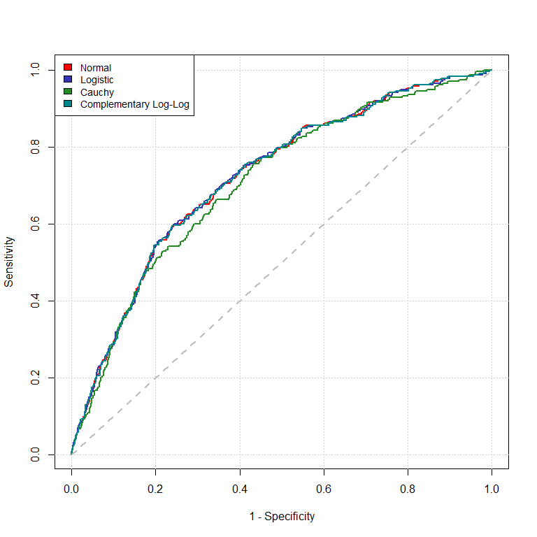
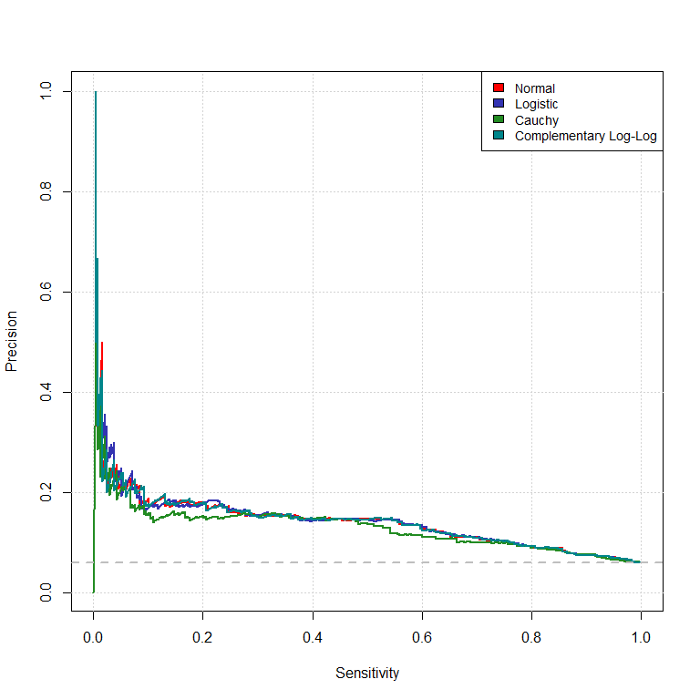
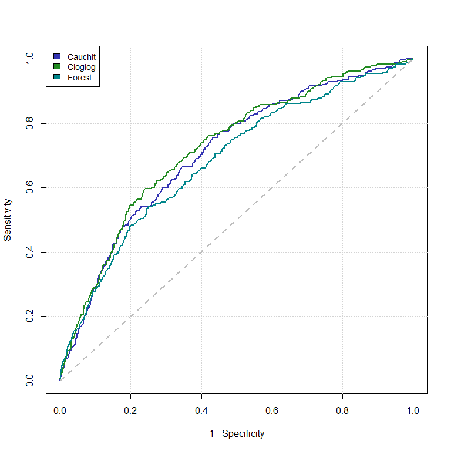
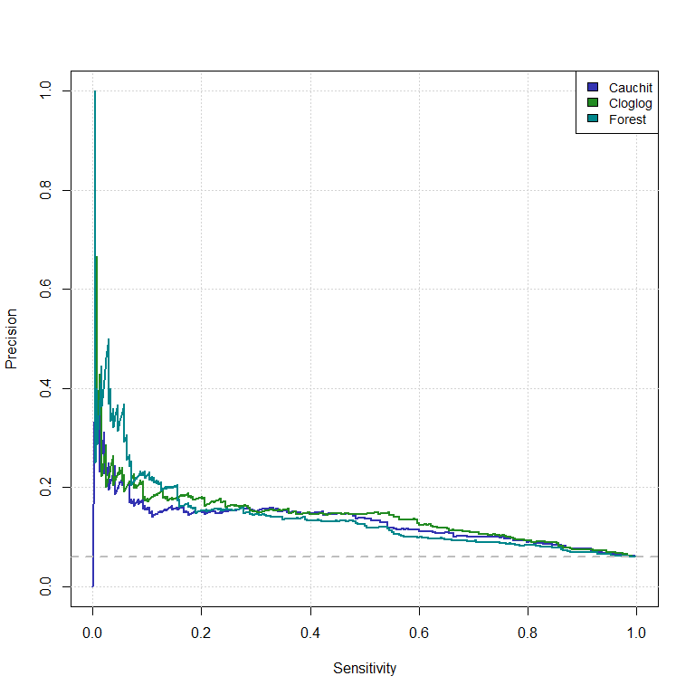
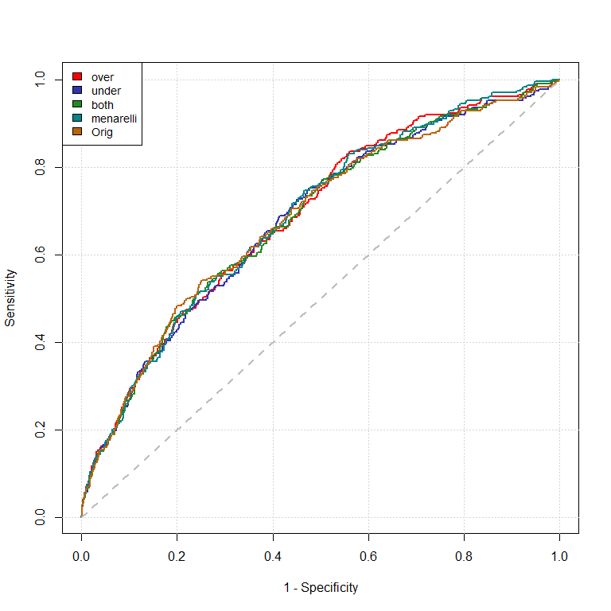
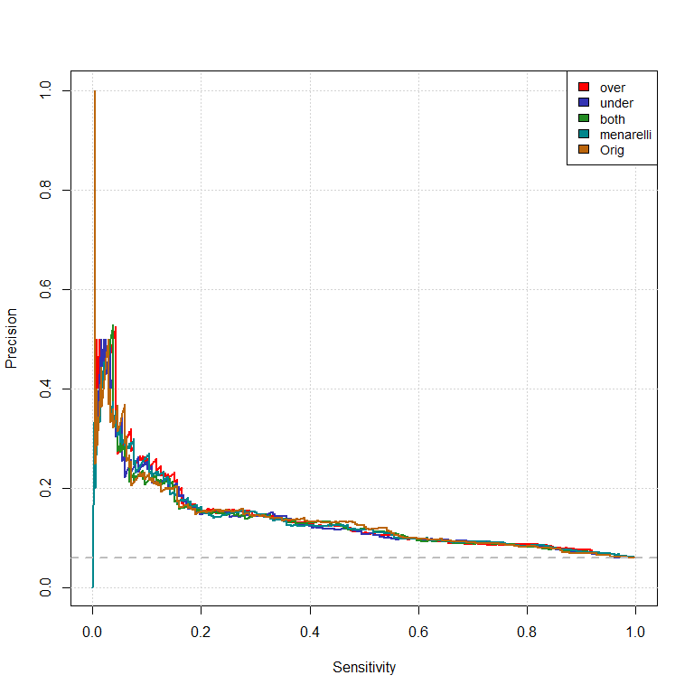

Caravan Insurance
================
01/17/2022

## 0.1 Packages

``` r
# Aux
source("Auxilliary.R")

# load or install packages
get.package(c("glmnet", "Matrix", "ROCR", "caret", "glmnetUtils", "randomForest",
              "mlbench", "ranger", "xgboost", "corrplot", "RColorBrewer",
               "ROSE"))
```

## 0.2 Data

``` r
# load
dat_carav <- as.data.frame(lapply(read.csv("caravan-insurance-challenge.csv"), as.character),                                                 stringsAsFactors = T)
# split 
dat_carav <- split(dat_carav, dat_carav$ORIGIN) |> setNames(c("test", "train"))


sapply(dat_carav[["train"]], class)
```

    ##   ORIGIN  MOSTYPE MAANTHUI  MGEMOMV MGEMLEEF MOSHOOFD   MGODRK   MGODPR 
    ## "factor" "factor" "factor" "factor" "factor" "factor" "factor" "factor" 
    ##   MGODOV   MGODGE   MRELGE   MRELSA   MRELOV MFALLEEN MFGEKIND MFWEKIND 
    ## "factor" "factor" "factor" "factor" "factor" "factor" "factor" "factor" 
    ## MOPLHOOG MOPLMIDD MOPLLAAG MBERHOOG MBERZELF MBERBOER MBERMIDD MBERARBG 
    ## "factor" "factor" "factor" "factor" "factor" "factor" "factor" "factor" 
    ## MBERARBO     MSKA    MSKB1    MSKB2     MSKC     MSKD   MHHUUR   MHKOOP 
    ## "factor" "factor" "factor" "factor" "factor" "factor" "factor" "factor" 
    ##    MAUT1    MAUT2    MAUT0  MZFONDS   MZPART  MINKM30 MINK3045 MINK4575 
    ## "factor" "factor" "factor" "factor" "factor" "factor" "factor" "factor" 
    ## MINK7512 MINK123M  MINKGEM MKOOPKLA  PWAPART  PWABEDR  PWALAND PPERSAUT 
    ## "factor" "factor" "factor" "factor" "factor" "factor" "factor" "factor" 
    ##  PBESAUT  PMOTSCO  PVRAAUT PAANHANG PTRACTOR   PWERKT    PBROM   PLEVEN 
    ## "factor" "factor" "factor" "factor" "factor" "factor" "factor" "factor" 
    ## PPERSONG  PGEZONG  PWAOREG   PBRAND  PZEILPL PPLEZIER   PFIETS  PINBOED 
    ## "factor" "factor" "factor" "factor" "factor" "factor" "factor" "factor" 
    ## PBYSTAND  AWAPART  AWABEDR  AWALAND APERSAUT  ABESAUT  AMOTSCO  AVRAAUT 
    ## "factor" "factor" "factor" "factor" "factor" "factor" "factor" "factor" 
    ## AAANHANG ATRACTOR   AWERKT    ABROM   ALEVEN APERSONG  AGEZONG  AWAOREG 
    ## "factor" "factor" "factor" "factor" "factor" "factor" "factor" "factor" 
    ##   ABRAND  AZEILPL APLEZIER   AFIETS  AINBOED ABYSTAND  CARAVAN 
    ## "factor" "factor" "factor" "factor" "factor" "factor" "factor"

``` r
# remove cvonst col from df

lapply(dat_carav, function(x){
  x[, "ORIGIN"] <- NULL
  x
}) -> dat_carav

sum(apply(dat_carav[["train"]], 2, function(x) any(is.na(x))))
```

    ## [1] 0

``` r
# # corr
# Cr <- cor(M)
# 
# # plot
# corrplot(Cr, type = "upper", order = "hclust",
#          col = brewer.pal(n = 8, name = "RdYlBu"), tl.cex = 0.5)
# 
# # mod corr matrix
# Cr_del <- Cr                 
# Cr_del[upper.tri(Cr_del)] <- 0
# diag(Cr_del) <- 0
# 
# # alternate matrix for which we remove highly correlated variables
# M_clow <- M[ ,apply(Cr_del, 2, function(x) all(abs(x) < 0.70))]
# 
# # check
# corrplot(cor(M_clow), type = "upper", order = "hclust",
#          col = brewer.pal(n = 8, name = "RdYlBu"), tl.cex = 0.5)
```

## 0.3 Benchmark Lasso GLM

Unfortunately we do not have enough time to fit “7.7371252^{25}” models,
accordingly we will make use of lasso regression to select the variables
for our model.

``` r
# lasso for model selection 
# different link functions of interest: gaussian, binomial, 

links <- c("logit", "probit", "cauchit", "cloglog")
lambdas <- numeric(length(links)) |> setNames(links)

# align
# par(mfrow = c(ceiling(length(links)/2), 2), mar=c(2,2,2,1))

# Cv and plot
# invis.lapply(links, function(l){
# 
#   # cross validation       
#   cvfit <- glmnetUtils::cv.glmnet(CARAVAN ~., data = dat_carav[["train"]], family = binomial(link = l),
#                              type.measure = "deviance", alpha = 1, nfolds = 10, nlambda = 20)
#   
#   # save lambdas (a bit dirty but safes us some time)
#   lambdas[l] <<- cvfit$lambda.min
#   
#   # plot
#   plot(cvfit); mtext(l, cex = 0.7)
#   
# })

# write to paremters folder in order to avoid re-runing the optimization
# write.csv(lambdas, "Parameters/optimal_parameters_Lasso.csv")

# lambdas
# knitr::kable(lambdas)
```

# 1 Random Forest

``` r
# control
ctrl <- caret::trainControl(method = "repeatedcv", number = 10, repeats = 2)

# tuning grid
# tgrid <- expand.grid("mtry" = seq(10, 50, 5),
#                      "splitrule" = "gini",
#                      "min.node.size" = 1:5)

# ext
tgrid <- expand.grid("mtry" = seq(5, 60, 5),
                     "splitrule" = "gini",
                     "min.node.size" = 1:7)
                     #"num.trees" = seq(500, 1000, 100))

# # train
# rf_carav <- caret::train(CARAVAN ~ ., data = dat_carav[["train"]], method = "ranger",
#                   metric = "Kappa", tuneGrid = tgrid, trControl = ctrl)
# 
# # safe
# saveRDS(rf_carav, "Parameters/tree.RDS")

# read results
param_tree <- readRDS("Parameters/tree.RDS")
besTrf <- param_tree$bestTune

# best tree model
ranger::ranger(CARAVAN ~ ., data = dat_carav[["train"]],
               mtry = besTrf[["mtry"]], splitrule = besTrf[, "splitrule"],
               min.node.size = besTrf$min.node.size, probability = T) -> besTrf_mod

# predict
Pred_val_mod_rf <- predict(besTrf_mod, dat_carav[["test"]])$predictions[, 2]
```

## 1.1 Benchmark Elastic-net GLM

Now that we have determined the predictive performance of lasso models
(alpha = 1), we will further examine if and by how much the predictive
performance increases when allowing for a variation in alpha (elastic
net).

``` r
# # CV
# sapply(links, function(l){
# 
#   # cross validation
#   cvfit <- glmnetUtils::cva.glmnet(CARAVAN ~., data = dat_carav[["train"]],
#                                    family = binomial(link = l),
#                                    type.measure = "deviance", nfolds = 10)
# 
#   # obtain min comb lambda and alpha
#   do.call(rbind, Map(function(x, y){
#  
#     cbind("Per" = x$cvm,
#           "Lambda" = x$lambda,
#           "Alpha" = rep(y, length(x$lambda)))
# 
#   }, cvfit$modlist, cvfit$alpha))-> per_matrix
# 
#   # obtain minimal combination
#   per_matrix[which.min(per_matrix[, "Per"]), ]
# 
# }) -> opt.para
# 
# # write to paremters folder in order to avoid re-runing the optimization
# write.csv(opt.para, "Parameters/optimal_parameters_elastic_net.csv")

# read opt parameters
opt.para <- read.csv("Parameters/optimal_parameters_elastic_net.csv")

# RoC curve 
Map(function(l, a, lin){

  # estimate "best" model
  fit <- glmnetUtils::glmnet(CARAVAN ~., data = dat_carav[["train"]], family = binomial(link = lin),
                        alpha = a, lambda = l)
   
  # CE on test data
  pred.vals <- predict(fit, dat_carav[["test"]], type = "response")
  
  # return
  return(list(pred.vals, fit))
  
}, opt.para[2, -1], opt.para[3, -1], links) -> glm_probs

# ext from list
glm_fits <- lapply(glm_probs, "[[", 2)
glm_prob_net <- lapply(glm_probs, "[[", 1)

# preliminary for plotting
glm_and_forest_pred_prob <- c(glm_prob_net, list(Pred_val_mod_rf)) |> 
  setNames(c("logit", "probit", "cauchit", "cloglog", "forest"))

prelim <- Eval_Curve_prel(glm_and_forest_pred_prob, 
                          as.numeric(dat_carav[["test"]][, "CARAVAN"]) - 1)
# only Glmnet
plot_ROC_net <- prelim[1:4]

# names for legend and colors
Links <- c("Normal", "Logistic", "Cauchy", "Complementary Log-Log")
col <-  c("red1", rgb(51, 51, 178, maxColorValue = 255),"forestgreen","turquoise4")

# RoC Plot 
Eval_Curve(plot_ROC_net, col = col, leg_text = Links)
```

<!-- -->

### 1.1.1 Precision Recall Curve

``` r
# Ps Curve
Eval_Curve(plot_ROC_net, col = col, leg_text = Links, RoC = FALSE, 
           act_label = as.numeric(dat_carav[["test"]][, "CARAVAN"]) - 1)
```

<!-- -->

``` r
# confusion matrices
knitr::kable(
lapply(glm_prob_net, function(x){
  table(as.numeric(x > 0.5), 
      as.numeric(dat_carav[["test"]][, "CARAVAN"]) - 1) 
}))
```

<table class="kable_wrapper">
<tbody>
<tr>
<td>

|     |    0 |   1 |
|:----|-----:|----:|
| 0   | 3760 | 236 |
| 1   |    2 |   2 |

</td>
<td>

|     |    0 |   1 |
|:----|-----:|----:|
| 0   | 3762 | 237 |
| 1   |    0 |   1 |

</td>
<td>

|     |    0 |   1 |
|:----|-----:|----:|
| 0   | 3738 | 231 |
| 1   |   24 |   7 |

</td>
<td>

|     |    0 |   1 |
|:----|-----:|----:|
| 0   | 3759 | 236 |
| 1   |    3 |   2 |

</td>
</tr>
</tbody>
</table>

### 1.1.2 Final Comparison

``` r
# RoC
Eval_Curve(prelim[3:5], col = col[2:4], leg_text = c("Cauchit", "Cloglog", "Forest"))
```

<!-- -->

``` r
# PR
Eval_Curve(prelim[3:5], col = col[2:4], leg_text = c("Cauchit", "Cloglog", "Forest"),
           RoC = FALSE, act_label = as.numeric(dat_carav[["test"]][, "CARAVAN"]) - 1)
```

<!-- --> \#\# Imbalance
Correction

One way to tackle the imbalance of the underlying data is different
sampling methods. The following chunk will explore a few to examine the
potential performance increase.

``` r
# over, under, both and by algorithm provided by the package ROSE (Menardi and Torelli (2013))
# over and under sampling is quite obv. 
# both: the minority class is oversampled with replacement and majority class 
# is undersampled without replacement.

# abs amount of pos and neg
n <- sum(as.numeric(dat_carav[["train"]][, "CARAVAN"] == 1)) 
N <- nrow(dat_carav[["train"]]) - n

# vec
meth <- c("over", "under", "both")
dat_carav_ts <- list()

# over under and both
# lapply doesnt work here for whatever reason ??
for(i in 1:3){
  
  # sample
  dat_carav_ts[[i]] <- ROSE::ovun.sample(CARAVAN ~ ., data = dat_carav[["train"]], 
                                         method = meth[i], seed = 33)$data
  
}  

# Menardi and Torelli algo
c(dat_carav_ts, list(ROSE::ROSE(CARAVAN ~ ., data = dat_carav[["train"]], seed = 33)$data)) |>
  setNames(nm = c("over", "under", "both", "menarelli")) -> dat_carav_ts 

# train rf for all datasets

# control
ctrl <- caret::trainControl(method = "repeatedcv", number = 10, repeats = 2)

# ext
tgrid <- expand.grid("mtry" = seq(50, 85, 5),
                     "splitrule" = "gini",
                     "min.node.size" = 3:9)
                     #"num.trees" = seq(500, 1000, 100))

# # loop over dfs
# Map(function(x, n){
# 
#   # I'll let this run overnight, hence the try wrapper
#   try({
# 
#     # CV
#     rf_carav_ts <- caret::train(CARAVAN ~ ., data = x, method = "ranger",
#                              metric = "Kappa", tuneGrid = tgrid, trControl = ctrl)
# 
#     # save
#     saveRDS(rf_carav_ts, paste0("Parameters/tree_", n, ".RDS"))
# 
#   })
# 
# }, dat_carav_ts, c("over", "under", "both", "menarelli"))

# read and fit
lapply(c("over", "under", "both", "menarelli"), function(n){

  # read
  best_tune <- readRDS(paste0("Parameters/tree_", n, ".RDS"))$bestTune
  
  # fit
  # best tree model
  ranger::ranger(CARAVAN ~ ., data = dat_carav[["train"]],
                 mtry = best_tune[["mtry"]], splitrule = best_tune[, "splitrule"],
                 min.node.size = best_tune$min.node.size, probability = T) -> besTrf_mod
  
  # predict
  predict(besTrf_mod, dat_carav[["test"]])$predictions[, 2]

}) |> setNames(c("over", "under", "both", "menarelli")) -> rf_carav_ts_res

# eval
prelim_ovun_rf <- Eval_Curve_prel(rf_carav_ts_res, 
                                  as.numeric(dat_carav[["test"]][, "CARAVAN"]) - 1)

# add orig tree
orig_ovun <- c(prelim_ovun_rf, list(prelim[[5]]))


# add col 
col <- c(col, "#BB650B")

# RoC
Eval_Curve(orig_ovun, col = col[1:5], leg_text = c("over", "under", "both", "menarelli", "Orig"))
```

<!-- -->

``` r
# PR
Eval_Curve(orig_ovun, col = col[1:5], leg_text = c("over", "under", "both", "menarelli", "Orig"),
           RoC = FALSE, act_label = as.numeric(dat_carav[["test"]][, "CARAVAN"]) - 1)
```

<!-- -->

## 1.2 XGB

In the setting of extreme gradient boosting we tune a model based on
trees as simple learner. The function used to implement the extreme
gradient boosting algorithm allows for a great verity of hyper
parameters to be tuned
(<https://xgboost.readthedocs.io/en/stable/parameter.html>). In what
follow we apply cross validation to tune, \* the learning rate,
![\\eta \\in \[0.01, 0.6\]](https://latex.codecogs.com/png.latex?%5Ceta%20%5Cin%20%5B0.01%2C%200.6%5D "\eta \in [0.01, 0.6]")
(default: 0.3), \* the regularization parameters,
![(\\gamma, \\lambda) \\in \[0,1\] \\times \[0.01,2\]](https://latex.codecogs.com/png.latex?%28%5Cgamma%2C%20%5Clambda%29%20%5Cin%20%5B0%2C1%5D%20%5Ctimes%20%5B0.01%2C2%5D "(\gamma, \lambda) \in [0,1] \times [0.01,2]")
(default: 0 and 1 respectively), \* the maximal depth of the trees,

(default: 6), \* the maximal number of single tree contained in one
model,
![nrounds \\in \[1,1000\]](https://latex.codecogs.com/png.latex?nrounds%20%5Cin%20%5B1%2C1000%5D "nrounds \in [1,1000]"),
by sampling of the respective range of the variables for each CV-step.
Furthermore we consider the fact that the distribution of the dependent
attribute is quite imbalanced (roughly
 of
observations have a caravan insurance) by setting the

adequate.

## 1.3 Performance (as measured in COIL comp.)

``` r
# Glms and forest
ttt <- c(glm_and_forest_pred_prob, rf_carav_ts_res, 
         list(readRDS('DEV_files/predXGB.RDS')[, 2]) |> setNames("XGB"))

# calc per
sapply(ttt, function(x) 
  COIL_per(x, as.numeric(dat_carav[["test"]][,"CARAVAN"]) - 1))[-9] -> COIL_res

knitr::kable(COIL_res, col.names = "COIL Performance")
```

|         | COIL Performance |
|:--------|-----------------:|
| logit   |              118 |
| probit  |              116 |
| cauchit |              114 |
| cloglog |              117 |
| forest  |              105 |
| over    |              100 |
| under   |               98 |
| both    |              104 |
| XGB     |               97 |
