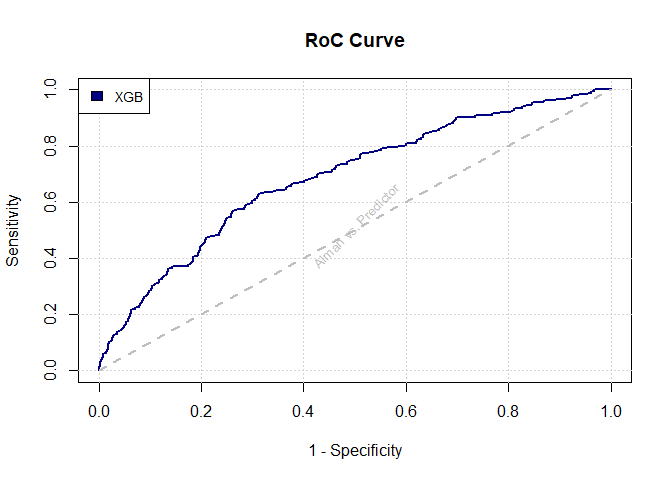

Presentation
================
01/15/2022

## 0.1 Packages

## 0.2 Data

# 1 XGBoost

  - the learning rate, ![\\eta \\in
    \[0.01, 0.6\]](https://latex.codecogs.com/png.latex?%5Ceta%20%5Cin%20%5B0.01%2C%200.6%5D
    "\\eta \\in [0.01, 0.6]") (default: 0.3),

  - the regularization parameters, ![(\\gamma, \\lambda) \\in \[0,1\]
    \\times
    \[0.01,2\]](https://latex.codecogs.com/png.latex?%28%5Cgamma%2C%20%5Clambda%29%20%5Cin%20%5B0%2C1%5D%20%5Ctimes%20%5B0.01%2C2%5D
    "(\\gamma, \\lambda) \\in [0,1] \\times [0.01,2]") (default: 0 and 1
    respectively),

  - the maximal depth of the trees,  (default: 6),

  - the maximal number of single trees contained in one model, ![nrounds
    \\in
    \[1,1000\]](https://latex.codecogs.com/png.latex?nrounds%20%5Cin%20%5B1%2C1000%5D
    "nrounds \\in [1,1000]"),

<!-- end list -->

``` r
#load predictions
predXBG <- readRDS(file = 'DEV_files/predXGB.RDS')

real4ecp <- predXBG$real
pred4ecp <- list(predXBG$pred)


#plots
ecp <- Eval_Curve_prel(act_label = pred4ecp, pred_val = real4ecp)

#
Eval_Curve(E_Curve_Prel = ecp, col = 'navyblue', leg_text = 'XGB')
```

<!-- -->

``` r
Eval_Curve(E_Curve_Prel = ecp, col = 'navyblue', leg_text = 'XGB', RoC = F)
```

<!-- -->
